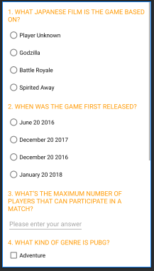

# QuizApp

The quiz application uses different activity and to communicate between activities intent is used. Start button change activity to start quiz.

The activity use scroll view or different UI components for displaying the question and Imageview class is used for image.

Submit button bring another activity for showing score.

